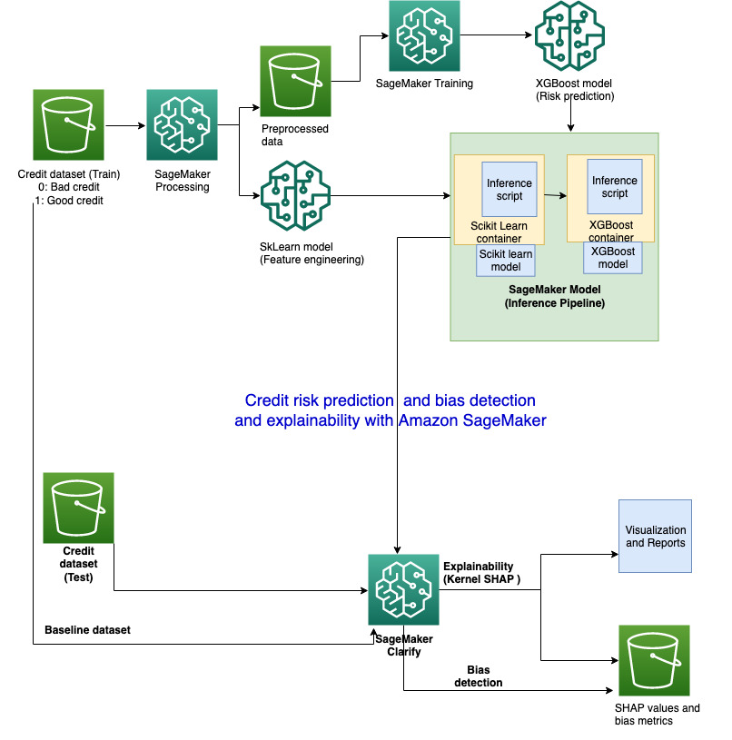

## Credit risk prediction and explainability and bias detection with Amazon SageMaker

In this workshop, we demonstrate a end to end ML use case of credit risk prediction with model explainability and bias detection. We use a well known open source dataset https://archive.ics.uci.edu/ml/datasets/South+German+Credit+%28UPDATE%29 .
We show how to use SageMaker Clarify to run explainability and bias detection on a SageMaker inference pipeline model. We include the explainability and bias reports from Clarify as well as relevant links to further resources on this subject.

Below is the architecture diagram used in the solution:

The notebook performs the following steps:

1. Prepare raw training and test data
2. Create a SageMaker Processing job which performs preprocessing on the raw training data and also produces an SKlearn model which is reused for deployment.
3. Train an XGBoost model on the processed data using SageMaker's built-in XGBoost container
4. Create a SageMaker Inference pipeline containing the SKlearn and XGBoost model in a series
5. Perform inference by supplying raw test data
6. Set up and run explainability job powered by SageMaker Clarify
7. Use open source shap library to create summary and waterfall plots to understand the feature importance better
8. Run bias analysis jobs
9. Clean up

The attached notebook can be run in Amazon SageMaker Studio. 

